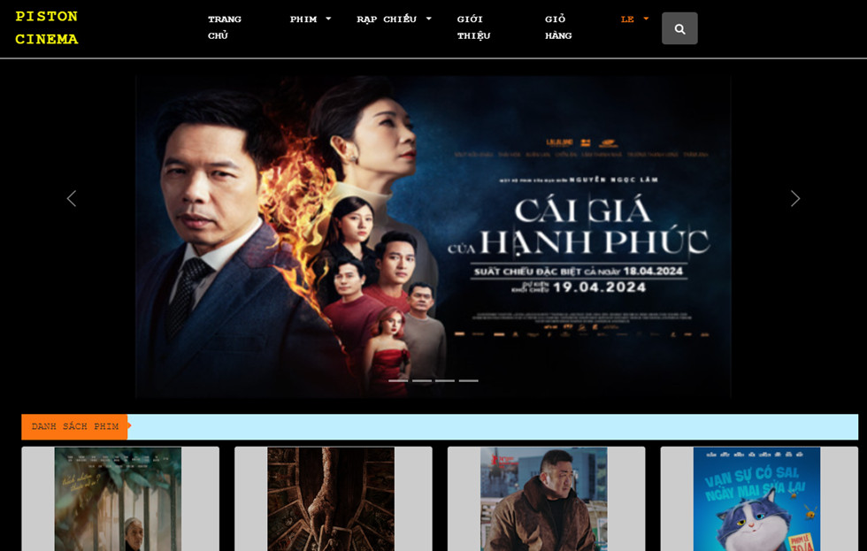

# Quan-ly-rap-chieu-phim

## Thông tin dự án

- Đề tài: Quản lý rạp chiếu phim
- Học phần: Lập trình mã nguồn mở - 12DHTH15
- Giảng viên: Đinh Nguyễn Trọng Nghĩa

## Công nghệ sử dụng

1. PHP 
2. Ampps version 4.3
3. Các thành phần khác:
    - phpMyAdmin
    - PHPMailer
    - framework Admin

## Thông tin thành viên
<table>
    <tr>
        <td>MSSV</td>
        <td>Họ tên</td>
        <td>Email</td>
    </tr>
    <tr>
        <td>2001215978</td>
        <td>Nguyễn Thị Huỳnh Nghi</td>
        <td>huynhnghi6809@gmail.com</td>
    </tr>
</table>

## Tiến độ dự án

- Thiết kế giao diện: Đã hoàn thành.
- Thiết kế cơ sở dữ liệu: Đã hoàn thành.
- Xây dựng chức năng trang web: Đã hoàn thành.
- Đặt ghế xem phim: Đã hoàn thành.
- Thêm vào giỏ hàng: Chưa hoàn thành.
- Xây dựng trang admin CRUD: Đã hoàn thành CRD / chưa hoàn thành Update
- Up lên host: <a href="http://nthnghi.infinityfreeapp.com/">http://nthnghi.infinityfreeapp.com/</a>
- Up lên youtube: <a href="https://youtu.be/FvDH9lIcdqM">https://youtu.be/FvDH9lIcdqM</a>
## Giấy phép

<a href="https://github.com/Huynhnghi/PistonCinema.git">Giấy phép</a>
